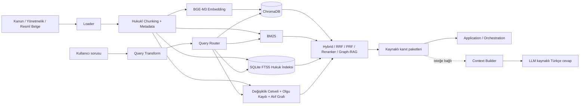

# KutupAI Hukukî RAG Katmanı

Bu klasör, KutupAI projesinin hukukî bilgi erişim katmanıdır. Mevzuat ve resmî belgeleri indeksler; kullanıcı sorusuna en ilgili, kaynaklı kanıt pasajlarını getirir.

RAG iki kullanım biçimi sunar:

- **Retrieval servisi:** Uygulama katmanına kaynak pasaj, kanun/madde bilgisi, sayfa ve skor verir. Ana takım entegrasyonunda LLM çalışmaz.
- **Yerel hukukî sohbet:** Aynı kanıt paketini OpenAI-uyumlu bir LLM'e göndererek kaynak etiketli Türkçe cevap üretir.

Sistem, kaynakta açıkça bulunmayan hukukî sonuç, tarih, ceza veya işlem adımı üretmez.

## Mimari



Akışın mantığı: önce kaynak metni ve yapısı hazırlanır; sonra soru tipi anlaşılır; uygun arama yolları seçilir; yalnız güçlü kanıtlar sonraki katmana aktarılır.

## Katmanlar

| Katman | Görev | Ana dosyalar |
|---|---|---|
| Kaynak yönetimi | Belgeleri kaynak türüne göre toplar. | `documents/`, `ingestion/loader.py` |
| Ingestion | Metni okur, chunk üretir ve indeksleri kurar. | `ingestion/pipeline.py` |
| Hukukî chunking | Madde/fıkra/bent sınırlarını korur. | `ingestion/chunker.py` |
| Metadata | Kanun, madde, sayfa, kaynak türü ve hukukî sinyalleri taşır. | `metadata/` |
| Vector retrieval | Anlam benzerliği ile aday bulur. | `embeddings/`, `chroma/`, `vector_store/` |
| Lexical retrieval | Tam terim, kanun ve madde numarası arar. | `retriever/hybrid.py`, SQLite FTS5 |
| Soru anlama | Soru sinyallerini çıkarır, retrieval planını seçer. | `query_metadata.py`, `query_frame.py`, `query_router.py` |
| Kanıt zenginleştirme | Fusion, PRF, reranker, ledger ve Graph-RAG uygular. | `retriever/`, `graph/` |
| Cevap güvenliği | Bağlamı sınırlar ve citation'ları doğrular. | `agent/` |
| Entegrasyon | Diğer katmanlar için sabit JSON sözleşmesi sağlar. | `client/contract_adapter.py` |

## Kaynaklar

| Yol | İçerik | Arama davranışı |
|---|---|---|
| `documents/laws/` | Kanunlar | Ana hukuk corpus'u |
| `documents/regulations/` | Yönetmelik, tebliğ ve bağlı düzenlemeler | Soru uygunsa kanunlarla birlikte |
| `documents/amendments/` | Değişiklik kaynakları | Yürürlük, iptal ve değişiklik soruları |
| `documents/reference_docs/` | Form, dilekçe, sözleşme, tutanak ve resmî belge örnekleri | Belge/nüsha odaklı sorularda kanun corpus'unu tamamlar |
| `documents/internal_docs/` | Kurum içi metinler | Ayrı metadata ile |
| `documents/uploads/` | Sonradan eklenen dosyalar | Kaynak türü korunarak |
| `documents/classification_data/` | Sınıflandırma verisi | Varsayılan olarak ana corpus dışı |

Metin tabanlı PDF, TXT, DOCX ve XLSX desteklenir. Taranmış görsel PDF, DOC ve XLS dosyaları OCR yapılmadığı için indekslenmez.

Yeni tek dosya ekleme örneği:

```powershell
python -m RAG.ingestion.pipeline --file "C:\tam\yol\yeni_kanun.pdf" --bucket laws
```

Corpus ilk kez kurulurken veya tamamen değiştiğinde:

```powershell
python -m RAG.ingestion.pipeline --reset
```

Bu komut chunk kaydını, Chroma indeksini, değişiklik cetvelini, olgu kaydını ve yerel hukuk indeksini birlikte oluşturur.

İndeksleme vektörler yazıldıktan sonra kesilirse, embedding'leri tekrar üretmeden yalnız yardımcı indeksleri yenilemek için:

```powershell
python -m RAG.ingestion.pipeline --rebuild-supporting-indexes
```

Bu kurtarma komutu mevcut Chroma vektörlerinden BM25, değişiklik cetveli, facts registry ve SQLite hukuk indeksini yeniden kurar.

## Hukukî chunking ve metadata

Sistem sabit karakter sayısına göre kör biçimde bölmez. Önce kanun numarasını ve başlığını bulur; sonra `Madde`, `Ek Madde`, `Geçici Madde`, fıkra ve bent sınırlarını tanır. Çok uzun madde bölünürse her parça aynı madde metadata'sını taşır.

Her chunk için örnek kayıt:

```json
{
  "chunk_id": "2692_4_00002_2ad9de959dd0",
  "law_number": "2692",
  "law_name": "Sahil Güvenlik Komutanlığı Kanunu",
  "article_no": "4",
  "article_type": "madde",
  "source_file": "2692_Sahil Güvenlik Komutanlığı.pdf",
  "source_type": "laws",
  "page_start": 2,
  "page_end": 2,
  "full_text": "..."
}
```

Bu alanlar metadata filtresinde, Graph-RAG ilişkilerinde, kaynak gösteriminde ve takım sözleşmesinde kullanılır.

## İndeksler ve modeller

| Bileşen | Kullanım nedeni |
|---|---|
| `BAAI/bge-m3` | Türkçe ve çok dilli anlam tabanlı arama için embedding üretir. |
| ChromaDB | Embedding vektörlerini ve metadata filtrelerini kalıcı tutar. |
| BM25 | Kanun numarası, KHK numarası ve özel hukuk terimlerinde tam eşleşme sağlar. |
| RRF | Vector ve BM25 sıralamalarını dengeli tek listede birleştirir. |
| `BAAI/bge-reranker-v2-m3` | Soru-pasaj ilişkisini tekrar değerlendirerek adayları sıralar. |
| SQLite FTS5 | Yerel tam metin, madde ve başlık araması sağlar. |
| `pdfplumber` | Değişiklik/yürürlük tablolarını yapılandırılmış kayda dönüştürür. |

`documents/.legal_index.sqlite`, pipeline tarafından üretilen yerel indekstir. Chunk metadata'sı, FTS kayıtları, değişiklik cetvelleri, çıkarılmış olgular ve atıf ilişkilerini tutar; corpus yerine geçen kaynak dosya değildir ve yeniden üretilebilir.

Değişiklik cetveli kaydı örneği:

```json
{
  "hedef_kanun_no": "2692",
  "degistiren_duzenleme_no": "668",
  "yururluk_tarihi_ham": "27/7/2016",
  "kaynak_sayfa": 23
}
```

Facts Registry; PDF'de açıkça yer alan süre, E./K. numarası, kanun atfı, iptal ve yürürlük bilgisini kaynak pasajına bağlı olarak saklar. Yeni hukuk kuralı üretmez.

## Query Transform ve Query Router

### Query Transform

Soru aramaya gitmeden önce hafif normalizasyondan geçer:

- `vergi nede sorgulanabilir` → `vergi nerede sorgulanabilir`
- `CMK 100` → `Ceza Muhakemesi Kanunu 100`

Bu yerel düzeltme her zaman aktiftir. İsteğe bağlı Qwen tabanlı sorgu varyantı açıksa, yalnız anlamı koruyan ve kalite filtresinden geçen varyantlar aramaya eklenir.

### Query Router

Router sabit konu sözlüğü kullanmaz. Kanun numarası, kanun adı, madde, KHK, tarih, yaptırım, atıf ve karşılaştırma sinyallerini çıkarır. Özel sinyal yoksa `semantic_hybrid` seçilir.

| Soru sinyali | Plan | Ana teknik |
|---|---|---|
| Açık kanun + madde | `exact_citation` | Metadata filtresi + vector + reranker |
| “Hangi maddede?” | `article_lookup` | Hybrid arama + madde seçimi |
| Özgün terim, ceza veya numara | `lexical_legal_lookup` | BM25 + vector + reranker |
| Değişiklik, KHK, yürürlük, mülga | `amendment_lookup` | Hybrid + ledger + yapılandırılmış kanıt |
| Birden çok kanun/madde ilişkisi | `multi_law_relation` | Hybrid + PRF + Graph-RAG |
| Serbest hukuk sorusu | `semantic_hybrid` | Hybrid + reranker |

## Retrieval hattı

1. Chroma, BM25 ve gerektiğinde SQLite FTS adayları toplanır.
2. Açık kanun, madde veya kaynak türü varsa metadata filtresi uygulanır.
3. Dense ve BM25 sonuçları RRF ile birleştirilir.
4. Geniş veya ilişkisel soruda PRF ile ek arama sinyali üretilir.
5. Atıf/değişiklik sorularında Graph-RAG, ledger ve facts kayıtları eklenir.
6. Cross-encoder reranker son adayları soru-pasaj ilişkisine göre sıralar.
7. Çok olgulu sorularda kanıt kapsama koruması, gerekli her olgunun sonuçlarda bulunmasını sağlar.

Varsayılan olarak sonraki katmana beş kaynaklı chunk verilir. Her sonuç; metin, skor, kanun, madde ve sayfa bilgisini içerir.

### Graph-RAG

Graph-RAG LLM ile ilişki uydurmaz. Yalnız metinde açıkça bulunan bağlantıları kullanır:

- madde → atıf yapılan kanun,
- değişiklik düzenlemesi → etkilenen madde → yürürlük tarihi,
- çıkarılmış olgu → kaynak chunk,
- aynı kanundaki açık madde bağlantıları.

Bu nedenle birden çok belgeyi ilgilendiren sorularda gerekli kanıtları birlikte getirir; kaynakta olmayan bağlantı kurmaz.

## LLM ile kaynaklı cevap

LLM isteğe bağlıdır. `Context Builder` tekrar eden pasajları temizler, bağlamı sınırlar ve her kaynağa `[S1]`, `[S2]` etiketi verir. Citation Validator yalnız bağlamda bulunan etiketleri kabul eder.

Varsayılan endpoint:

```yaml
agent:
  base_url: "http://127.0.0.1:8080/v1/chat/completions"
```

RAG model dosyasına doğrudan bağlı değildir. Qwen GGUF, vLLM, LM Studio, Ollama veya başka bir OpenAI-uyumlu servis kullanılabilir. Servisin en az aşağıdaki yapıyı desteklemesi yeterlidir:

```json
{"messages":[{"role":"system","content":"..."},{"role":"user","content":"..."}],"temperature":0.0}
```

```json
{"choices":[{"message":{"content":"Türkçe cevap"}}]}
```

Farklı JSON sözleşmesi olan model için RAG kodu değil `Inference/client/llama_client.py` adaptörü güncellenir.

Çok turlu sohbette önceki konuşma yalnız takip sorularını anlamak için kullanılır; önceki cevaplar bağımsız hukukî kaynak sayılmaz. Semantic cache ise önceden doğrulanmış, çok benzer soruları hızlandırır.

## Takım entegrasyonu

Ana uygulama RAG'i `RAG.client.handle_rag_request` ile çağırır. Resmî input/output alanları [RAG-contract.md](../Layers_contracts/Layers_contracts/RAG-contract.md) dosyasındadır. Bu entegrasyon akışında RAG yalnız `rag` alanını doldurur ve LLM çağrısı yapmaz.

Örnek giriş:

```python
from RAG.client import handle_rag_request

result = handle_rag_request({
    "request": {"success": True, "question": "CMK 100. maddede tutuklama şartları nelerdir?"},
    "ocr": {"success": True, "ocr_data": {"full_text": "..."}},
    "classification": {"success": True, "document_type": "kanun"},
    "extraction": {}, "validation": {}, "rag": {}, "summary": {}, "routing": {}, "writing": {}
})
```

Çıktı özeti:

```json
{
  "rag": {
    "success": true,
    "rag_data": {
      "operation": "retrieve",
      "query": "kullanıcı sorusu",
      "results": [{"chunk_id":"...","law_number":"5271","article_no":"100","page_start":1,"page_end":1,"text":"...","score":0.0}]
    }
  }
}
```

Application/Orchestration katmanı bu kanıtları kendi LLM'ine göndererek nihai cevabı üretebilir. Böylece retrieval, model ve kullanıcı arayüzü birbirinden bağımsız kalır.

## Yapılandırma ve klasör haritası

Tüm ayarlar `configuration/rag_config.yaml` içindedir. `documents`, `chunking`, `embedding`, `retrieval`, `reranker`, `query_transform`, `graph_rag`, `agent` ve `observability` bölümleri kod değiştirmeden davranışı yönetir.

```text
RAG/
├── configuration/       # YAML ayarları
├── documents/           # Corpus ve üretilen kayıtlar
├── ingestion/           # Loader, chunking, pipeline
├── metadata/            # Şema, SQLite indeks, facts registry
├── embeddings/          # BGE-M3 yükleme
├── chroma/              # ChromaDB yapılandırması
├── vector_store/        # Store arayüzü
├── retriever/           # Router, hybrid, PRF, reranker, transform
├── graph/               # Kanıtlı hukukî ilişki grafı
├── agent/               # Context, citation, cache, LLM cevabı
├── client/              # Takım katmanları için adapter
└── scripts/             # Pipeline ve yerel çalışma komutları
```

## Kurulum ve çalıştırma

```powershell
python -m venv .venv
.\.venv\Scripts\Activate.ps1
python -m pip install --upgrade pip
python -m pip install -r RAG/requirements.txt
python -m RAG.ingestion.pipeline --reset
```

İsteğe bağlı Hugging Face token için `RAG/.env.example` dosyasını `RAG/.env` olarak kopyalayın ve kendi token'ınızı ekleyin. `.env` Git'e eklenmemelidir.

Yalnız retrieval sonuçlarını görmek için:

```powershell
.\RAG\scripts\run_retrieval.ps1
```

Yerel LLM ile kaynaklı sohbet için Inference sunucusu açıkken:

```powershell
.\RAG\scripts\run_legal_agent.ps1
```

Hugging Face token zorunlu değildir; ilk model indirmesinde hız ve rate-limit avantajı sağlar:

```powershell
$env:HF_TOKEN = "huggingface_tokeniniz"
```

## Sınırlar ve güvenlik

- Sistem OCR yapmaz; taranmış PDF'ler güvenilir metin gibi işlenmez.
- Retrieval sonucu hukukî danışmanlık değil, kaynaklı bilgi erişimidir.
- LLM yalnız getirilen bağlama dayanmalıdır.
- Kaynak, madde veya tarih açık değilse kesin sonuç üretilmemelidir.
- Chroma, SQLite, cache ve indirilen modeller yerel/rebuild edilebilir çalışma verisidir; PDF corpus ve hazır chunk kaydı teslim verisidir.
