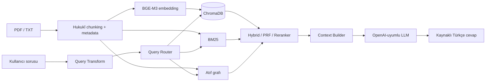

# Hukukî RAG Katmanı

Bu klasör, KutupAI projesinin Türkçe hukukî kaynakları indeksleyen, getiren ve kaynaklı cevap üreten RAG katmanıdır. RAG ekibinin teslim/sahiplik sınırı `RAG/` ve `Tests/RAG/` klasörleridir. `Inference/` model sunucusunu sağlar; RAG bu katmana yalnız HTTP istemcisi olarak bağlanır.

## Sistem ne yapar?

- Kanun ve yönetmelik PDF'lerini yükler; hukukî madde yapısını koruyarak chunk'lara ayırır.
- Chunk kimliği, kanun/madde numarası, kaynak dosya, sayfa ve kaynak türü metadata'sı üretir.
- BGE-M3 embedding'lerini ChromaDB'ye kalıcı olarak indeksler.
- Dense retrieval, BM25, RRF hybrid, PRF, reranker, metadata filtresi ve Graph-RAG'i soru tipine göre birleştirir.
- Qwen veya başka bir OpenAI-uyumlu LLM ile kaynaklı Türkçe cevap üretir.
- Citation doğrulaması, Query Transform, semantic cache ve çok turlu konuşma belleği uygular.



## Kullanılan teknoloji ve modeller

| Katman | Araç/model | Görev |
|---|---|---|
| PDF yükleme | `PyPDFLoader`, `pypdf`, LangChain Community | PDF/TXT kaynaklarını okumak |
| Doküman sözleşmesi | `langchain-core` `Document` | Chunk ve metadata aktarımı |
| Chunking | `RAG/ingestion/chunker.py` | Hukukî madde sınırlarını korumak |
| Embedding | `BAAI/bge-m3` | Türkçe/çok dilli dense retrieval |
| Vektör store | ChromaDB + `langchain-chroma` | Kalıcı indeks ve metadata filtresi |
| Lexical arama | `rank-bm25` | Tam terim ve kanun numarası eşleşmesi |
| Fusion | RRF | Dense ve BM25 adaylarını birleştirmek |
| PRF | Yerel pseudo relevance feedback | Geniş sorgularda recall artırmak |
| Reranker | `BAAI/bge-reranker-v2-m3` | Adayları soru-pasaj ilişkisine göre sıralamak |
| Graph-RAG | `RAG/graph/legal_graph.py` | Madde atıf/ilişki genişletmesi |
| Cevap LLM'i | Qwen2.5-7B-Instruct GGUF Q4 (varsayılan) | Kaynaklı Türkçe cevap |
| Query Transform LLM'i | Qwen2.5-1.5B-Instruct GGUF Q4 (isteğe bağlı) | Ek sorgu varyantları |
| Test/ölçüm | `psutil`, `pytest` | Gecikme, RAM ve regresyon testi |

`torch`, `runtime.device: auto` ayarında CUDA varsa GPU'yu, yoksa CPU'yu seçer. Tüm çalışma ayarları Türkçe açıklamalarıyla `RAG/configuration/rag_config.yaml` içindedir.

## Klasör yapısı

| Yol | Açıklama |
|---|---|
| `configuration/` | Tek merkezli YAML ayarı ve typed config loader |
| `documents/` | Corpus, kaynak README'leri ve chunk kaydı |
| `ingestion/` | Loader, enrichment, manifest ve indeksleme pipeline'ı |
| `embeddings/` | BGE-M3 model yükleme |
| `chroma/`, `vector_store/` | ChromaDB yapılandırması ve store adaptörü |
| `retriever/` | BM25, hybrid, PRF, router, reranker, Query Transform |
| `graph/` | Hukukî madde-atıf grafı |
| `agent/` | LLM bağlamı, citation, cache ve konuşma belleği |
| `client/` | Diğer takım agent'ları için sabit RAG istemci sözleşmesi |
| `evaluation/` | Benchmark kodu, metrikler ve versionlanan veri setleri |
| `scripts/` | Retrieval/legal-agent CLI komutları |
| `../Tests/RAG/` | Otomatik testler, benchmark ve ana manuel sohbet testi |

## Corpus ve Git LFS

| İçerik | Yol | Yaklaşık boyut |
|---|---|---:|
| Kanun PDF'leri | `documents/laws/*.pdf` | 31 MB |
| Yönetmelik PDF'leri | `documents/regulations/*.pdf` | 15 MB |
| Hazır chunk kaydı | `documents/indexed_chunks.json` | 32 MB |

PDF'ler ve `indexed_chunks.json` Git LFS ile izlenir:

```powershell
git lfs install
git lfs pull
```

`documents/.chroma_db/`, `.semantic_cache.json`, `evaluation/models/`, `evaluation/experiments/`, Hugging Face cache ve `.venv` yerel çıktıdır; Git'e eklenmez.

## Kurulum ve indeksleme

Proje kök dizininden çalıştırın:

```powershell
python -m venv .venv
.\.venv\Scripts\Activate.ps1
python -m pip install --upgrade pip
pip install -r RAG/requirements.txt
python -m RAG.ingestion.pipeline --reset
```

Tek kaynak ekleme:

```powershell
python -m RAG.ingestion.pipeline --file "C:\tam\yol\yeni_kanun.pdf" --bucket laws
```

Kaynak türüne göre `laws`, `regulations`, `amendments`, `internal_docs` veya `uploads` bucket'ı kullanılabilir. Yeni kaynak eklendikten sonra indeks güncellenmelidir. İlk model indirmesinde Hugging Face token'ı isteğe bağlı olarak hız/rate-limit avantajı sağlar:

```powershell
$env:HF_TOKEN = "huggingface_tokeniniz"
```

## Çalıştırma

### Ana manuel sohbet ve test arayüzü

Günlük kullanıcı testi için temel dosya budur:

```powershell
python Tests/RAG/run_llm_evaluation.py --no-cache
```

Bu ekran cevap, kaynaklar, retrieval planı, Query Transform varyantları, cache, retrieval/generation süreleri ve konuşma belleği bilgisini gösterir.

| Komut/seçenek | İşlev |
|---|---|
| `q`, `exit`, `çıkış` | Sohbetten çıkar |
| `clear`, `temizle`, `yeni konu` | Sadece konuşma belleğini sıfırlar |
| `--no-cache` | Kalıcı semantic cache'i kapatır; test için önerilir |
| `--query-transform-llm` | Bu oturumda LLM tabanlı Query Transform'u açar |

### Sadece retrieval

```powershell
.\RAG\scripts\run_retrieval.ps1
```

Bu mod LLM çağırmadan chunk, skor, kanun, madde ve sayfa bilgisini verir.

### Tek turlu legal-agent CLI

```powershell
.\RAG\scripts\run_legal_agent.ps1
python -m RAG.scripts.ask_legal_agent "KVKK 5. maddede veri işleme şartları nelerdir?"
```

## Varsayılan Qwen ile cevap üretimi

RAG cevap katmanı OpenAI Chat Completions uyumlu endpoint bekler. Varsayılan ayar:

```yaml
agent:
  base_url: "http://127.0.0.1:8080/v1/chat/completions"
```

Takımın Qwen2.5-7B GGUF sunucusunu ayrı terminalde başlatın:

```powershell
.\Inference\llama_server\server_launcher.bat
```

Sunucu `127.0.0.1:8080` üzerinde çalıştıktan sonra RAG LLM cevap üretebilir. Launcher GPU için `-ngl 99` kullanır; uygun CUDA yoksa Inference ekibinin CPU uyumlu launcher/ayarını kullanın.

## Başka bir LLM ile entegrasyon

Qwen zorunlu değildir. vLLM, LM Studio, Ollama'nın OpenAI-uyumlu endpoint'i, başka bir llama.cpp sunucusu veya kurum içi gateway kullanılabilir. Servisin aşağıdaki sözleşmeyi desteklemesi yeterlidir:

```json
{
  "messages": [{"role": "system", "content": "..."}, {"role": "user", "content": "..."}],
  "temperature": 0.0,
  "top_p": 1.0,
  "max_tokens": 450,
  "stream": false
}
```

Beklenen yanıtta en az şu alan bulunmalıdır:

```json
{"choices": [{"message": {"content": "Türkçe cevap"}}]}
```

Yeni model OpenAI-uyumluysa yalnız `RAG/configuration/rag_config.yaml` içindeki `agent.base_url` değerini değiştirin. Endpoint farklı JSON sözleşmesi kullanıyorsa RAG kodunu değil `Inference/client/llama_client.py` adapter'ını güncelleyin; böylece `RAG.agent.LegalRagAgent` ve RAG pipeline'ı sabit kalır.

Model değişiminden sonra:

```powershell
python -m pytest Tests/RAG -q
python Tests/RAG/run_llm_evaluation.py --no-cache
```

Citation (`[S1]`) ve Türkçe talimat uyumunu manuel olarak da kontrol edin.

## Query Transform

Kural tabanlı düzeltme her zaman aktiftir: `nede` → `nerede`, `nerden` → `nereden`, `CMK` → `Ceza Muhakemesi Kanunu`. Bu yol ana LLM'e bağımlı değildir.

Ek LLM sorgu varyantları için:

```yaml
query_transform:
  enabled: true
  use_llm: true
  base_url: "http://127.0.0.1:8081/v1/chat/completions"
```

Önce ayrı dönüşüm sunucusunu açın:

```powershell
.\Inference\llama_server\query_transform_launcher.bat
```

Sonra:

```powershell
python Tests/RAG/run_llm_evaluation.py --query-transform-llm --no-cache
```

Ekran kural tabanlı düzeltmeleri ve LLM'in ürettiği alternatifleri ayrı gösterir. LLM kısa/bozuk bir sorgu üretirse kalite filtresi retrieval'a dahil etmez. Dönüşüm sunucusu kapalıysa sistem kural tabanlı dönüşüme geri döner.

## Retrieval stratejileri

| Soru türü | Seçilen yol | Açıklama |
|---|---|---|
| Açık kanun + madde | `exact_citation` | Metadata filtresi + vector + reranker |
| “Hangi maddede?” | `article_lookup` | Hibrit arama + deterministik madde seçimi |
| Genel hukuk sorusu | `semantic_fast` | Dense retrieval + reranker |
| Tebliğ/yönetmelik/terim | `lexical_legal_lookup` | Hybrid lexical + semantic arama |
| Atıf/ilişki/karşılaştırma | `legal_relationship` | Hybrid + PRF + Graph-RAG FULL |

## Güvenilirlik ve konuşma belleği

- Context Builder tekrar eden pasajları temizler ve LLM bağlamını sınırlar.
- Citation Validator yalnız bağlamdaki `[S1]`, `[S2]` etiketlerini kabul eder.
- Eksik kanun/madde referansı model çağrısı yapılmadan reddedilir.
- Tekrarlanan uzun LLM cümleleri cache'e yazılmadan temizlenir.
- Son üç sohbet turu LLM'e bellek olarak iletilir; eski cevaplar bağımsız hukukî kaynak sayılmaz. Yeni konu açıkça başlatılırsa eski bellek taşınmaz.

Bu sistem bilgilendirme amaçlıdır; hukuken bağlayıcı danışmanlık yerine geçmez.

## Test ve benchmark

```powershell
# Otomatik/regresyon testleri
python -m pytest Tests/RAG -q

# LLM'siz retrieval benchmark: Hit@k, MRR, gecikme, RAM ve disk
python Tests/RAG/run_retrieval_evaluation.py

# Ana manuel LLM sohbet testi
python Tests/RAG/run_llm_evaluation.py --no-cache
```

Benchmark çıktıları `RAG/evaluation/experiments/` altında yerel kalır ve Git'e eklenmez. Versionlanan veri setleri `RAG/evaluation/datasets/` altındadır. FAISS/TurboVec benchmark seçenekleri deneysel görünse de bu teslimde çalışan ve desteklenen vektör store adaptörü ChromaDB'dir.

## Diğer takım modülleri için istemci sözleşmesi

Agent/Application katmanı doğrudan Chroma veya retriever import etmemelidir.

### Ekipler arası JSON sözleşmesi (ana entegrasyon)

Resmî input/output alanları
[`Layers_contracts/Layers_contracts/RAG-contract.md`](../Layers_contracts/Layers_contracts/RAG-contract.md)
dosyasında tanımlıdır. Application/Orchestration katmanı tüm state nesnesini
tek giriş fonksiyonuna verir. RAG yalnız `rag` alanını doldurur; diğer katman
alanlarını değiştirmez ve bu akışta hiçbir LLM çağrısı yapmaz:

```python
from RAG.client import handle_rag_request

result = handle_rag_request({
    "request": {
        "success": True,
        "question": "bu ne sözleşmesi",
        "document": {"document_id": "DOC-001", "file_name": "Elektrik sözleşmesi.pdf", "file_type": "pdf"},
    },
    "ocr": {"success": True, "ocr_data": {"full_text": "..."}},
    "classification": {"success": True, "document_type": "Elektrik sözleşmesi"},
    "extraction": {}, "validation": {}, "rag": {}, "summary": {}, "routing": {}, "writing": {},
})
```

RAG'ın eklediği alan yalnızca aşağıdaki biçimdedir:

```json
{
  "rag": {
    "success": true,
    "rag_data": {
      "operation": "retrieve",
      "query": "kullanıcı sorusu + belge sinyalleri",
      "results": [
        {
          "chunk_id": "...",
          "law_number": "...",
          "law_name": "...",
          "article_no": "...",
          "page_start": 1,
          "page_end": 1,
          "text": "...",
          "score": 0.0
        }
      ]
    }
  }
}
```

Retrieval için soru, belge türü ve OCR metninin sınırlı bir kesiti kullanılır.
Kural tabanlı yazım düzeltmesi açıktır; Query Transform LLM'i ve cevap üretim
LLM'i bu sözleşme akışında kapalıdır.

### Eski iç Python retrieval arayüzü

RAG içindeki Agent'lar için düşük seviyeli, geriye uyumlu giriş noktası:

```python
from RAG.client import RetrievalRequest, get_legal_context

response = get_legal_context(
    RetrievalRequest(
        query="CMK 100. maddede tutuklama şartları nelerdir?",
        top_k=5,
        use_reranker=True,
    )
)

print(response.context)
print(response.sources)
```

## Teslim öncesi kontrol

```powershell
git lfs install
git lfs pull
pip install -r RAG/requirements.txt
python -m RAG.ingestion.pipeline --reset
python -m pytest Tests/RAG -q
python Tests/RAG/run_llm_evaluation.py --no-cache
git add RAG Tests/RAG
git status
git lfs ls-files
```

`git add .` yerine `git add RAG Tests/RAG` kullanın; bu diğer ekiplerin değişikliklerini yanlışlıkla stage etmeyi önler.
